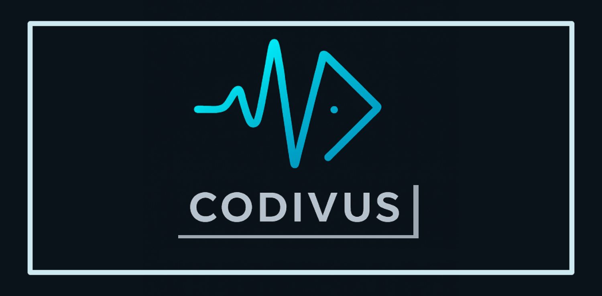

# 🔍 Codivus - AI-Enabled Code Scanning Solution

A modern, AI-powered code scanning solution designed to analyze code repositories for potential issues, vulnerabilities, and improvement opportunities.

## 🚀 Features

- **Real-time scanning dashboard**: Monitor scanning progress in real-time
- **Interactive repository visualization**: Browse repository file structure through an interactive graph
- **AI-powered analysis**: Leverage Ollama and LMStudio for advanced code analysis
- **IssueHunter integration**: Advanced issue detection and categorization
- **Local and GitHub repository support**: Scan code from local paths or GitHub repositories
- **Modern tech stack**: Vue.js front-end, C# .NET 8 back-end

## 🏗️ Architecture

Codivus consists of three main components:

1. **Codivus.UI**: Vue.js-based front-end application
2. **Codivus.API**: C# .NET 8 RESTful API
3. **Codivus.Core**: Core library containing shared business logic and models

## 📝 Requirements

- **.NET 8 SDK**
- **Node.js** v16+
- **npm** v7+
- **Local LLM provider** (Ollama or LMStudio)

## 🔧 Setup and Installation

See [Installation Guide](./docs/installation.md) for detailed setup instructions.

## 🧪 Development

See [Development Guide](./docs/development.md) for information on project structure and contribution guidelines.

## 📚 Documentation

Complete documentation can be found in the [docs](./docs/) directory.

## 📄 License

MIT
